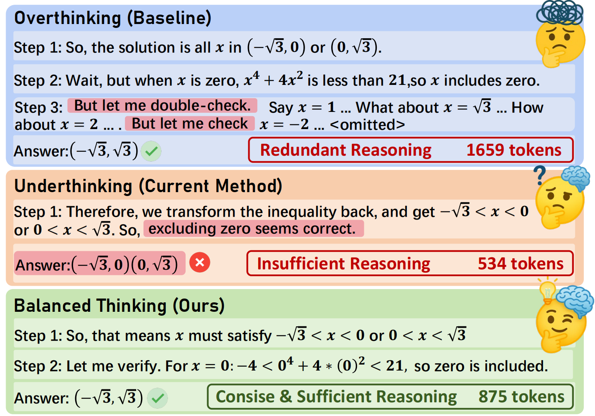
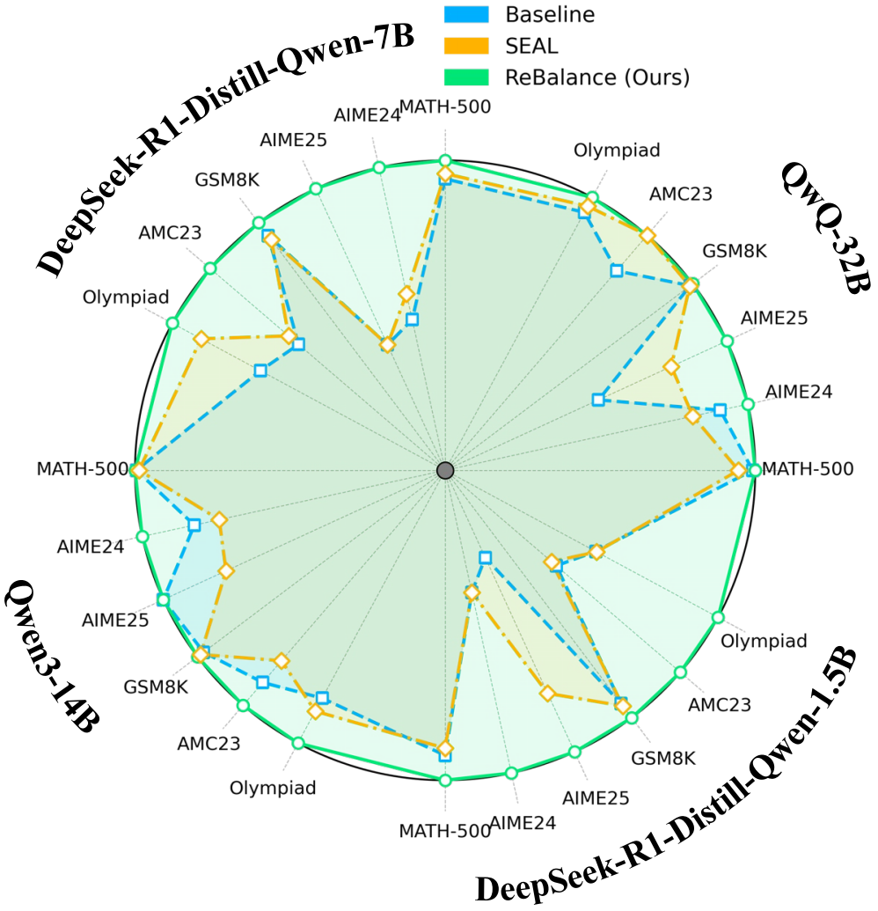
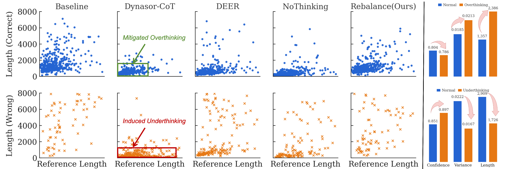
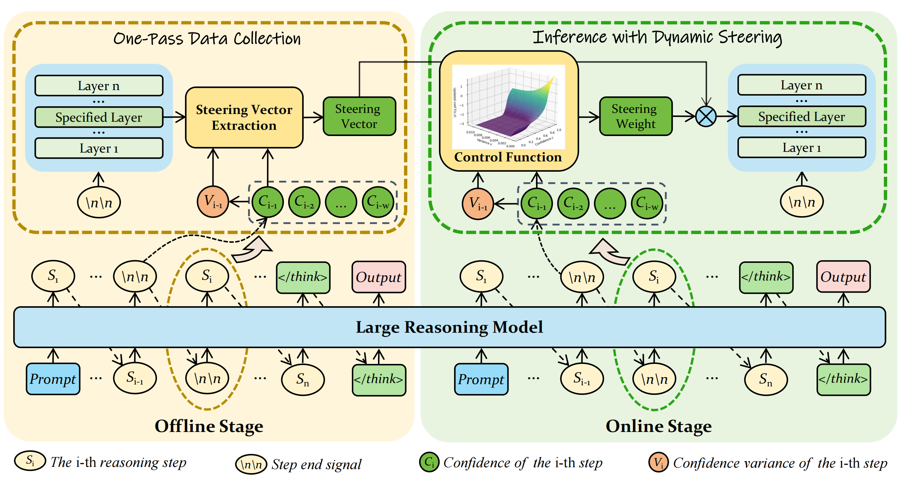

# Efficient Reasoning with Balanced Thinking

<div align="center">
<a href="https://scholar.google.com/citations?user=dQssXVsAAAAJ&hl=en">Yulin Li</a><sup>1†</sup>,&nbsp;
<a href="https://openreview.net/profile?id=~Tengyao_Tu2">Tengyao Tu</a><sup>1,5†</sup>,&nbsp;
<a href="https://openreview.net/profile?id=~Li_Ding10">Li Ding</a><sup>1</sup>,&nbsp;
<a href="https://scholar.google.com/citations?user=q60ZlP8AAAAJ&hl=en">Junjie Wang</a><sup>1</sup>,&nbsp;
<a href="https://scholar.google.com.hk/citations?user=gq29DtwAAAAJ&hl=en">Huiling Zhen</a><sup>2</sup>,&nbsp;
<a href="https://scholar.google.com/citations?user=tEWGP3sAAAAJ&hl=en">Yixin Chen</a><sup>4</sup>&nbsp;
<a href="https://scholar.google.com/citations?user=kmgzPeQAAAAJ&hl=en">Yong Li</a><sup>3,5</sup>&nbsp;
<a href="https://scholar.google.com/citations?user=mEjhz-IAAAAJ&hl=en">Zhuotao Tian</a><sup>1,6*</sup>&nbsp;
<br>
<sup>1</sup> Harbin Institute of Technology (Shenzhen) &nbsp;&nbsp;&nbsp;
<sup>2</sup> Huawei Noah's Ark Lab &nbsp;&nbsp;&nbsp;
<sup>3</sup> Tsinghua University
<br>
<sup>4</sup> The Chinese University of Hong Kong &nbsp;&nbsp;&nbsp;
<sup>5</sup> Zhongguancun Academy &nbsp;&nbsp;&nbsp;
<sup>6</sup> Shenzhen Loop Area Institute
<br>
<sup>†</sup>Equal Contribution &nbsp;&nbsp;&nbsp;
<sup>*</sup>Corresponding Author
<br>
<a href='https://iclr.cc/'></a> &nbsp;
<a href="https://arxiv.org/abs/2603"></a> &nbsp;
<a href='https://openreview.net/forum?id=cJseWJJ5IM'></a> &nbsp;
<a href='https://yulin.github.io/ReBalance/'></a> &nbsp;
<a href="LICENSE"></a> &nbsp;
</div>

## 📚 TABLE OF CONTENTS

1. [Why ReBalance](#-why-rebalance)
2. [Motivation](#-motivation)
3. [Method](#-method)
4. [News](#-news)
5. [TODO](#-todo)
6. [Quick Start](#-quick-start)
7. [Acknowledgements](#️-acknowledgements)
8. [Citation](#-citation)

## 🏆 Why ReBalance

<p align="center">
  
  &nbsp;&nbsp;&nbsp;&nbsp;&nbsp;&nbsp;
  
</p>

1. **Balanced Thinking Unlocking Smarter Reasoning.** Given the question ``For what real values of $x$ is $-4 < x^{4} + 4x^{2} < 21$?'', the model first obtains intervals $(-\sqrt{3}, 0)$ and $(0, \sqrt{3})$, and then verifies if $x = 0$ is included. However, the model redundantly checks irrelevant values after correctly validating $x = 0$, causing overthinking. Current mitigation methods overly suppress necessary reflection, leading to underthinking. Our ReBalance dynamically controls the reasoning state, effectively balancing these two extremes.
2. **Superior Performance.** ReBalance outperforms previous state-of-the-art methods across multiple mathematical reasoning datasets and model scales (0.5B–32B), reducing reasoning length while simultaneously improving accuracy.

## 🎯 Motivation

<p align="center">
  
</p>

1. **Effects of overthinking mitigation on reasoning modes.** We compare the distributions of reasoning lengths for correct and incorrect predictions before and after applying overthinking mitigation methods. The reduction in reasoning lengths for correct and incorrect predictions indicates the degree to which overthinking is mitigated and underthinking is introduced, respectively. Existing methods significantly introduce underthinking, whereas our ReBalance effectively achieves a balanced reduction of both.
2. **Correlation between confidence and reasoning modes.** We observe that the overthinking samples exhibit higher confidence variance compared to normal samples, while underthinking samples show persistently high confidence levels.

## 🌈 Method

<p align="center">
  
</p>

1. **One-Pass Data Collection.** We first perform offline one-pass data collection on a small-scale seen dataset. At each step, the steering vector is extracted at the first token of the specified layer based on confidence, and a dynamic function is fitted according to model behaviors.
2. **Inference with Dynamic Steering.** During deployment, the dynamic function outputs steering weights based on the model's real-time confidence online, thus balancing between overthinking and underthinking

## 🎉 News

* **[2026.03.12]**  We Release the code and steering vectors for **DeepSeek-R1-Distill-Qwen** (1.5B, 7B), **QwQ-32B**, and [**openPangu-Embedded-7B-V1.1**](https://github.com/yu-lin-li/ReBalance/tree/openPangu). Happy coding!
* **[2026.01.26]**  Our paper has been accepted by **ICLR 2026**🎖️.

## 🔥 TODO

* [x] Initialize Project.
* [ ] Release the code and steering vectors for Qwen3-14B.

## 🚀 Quick Start

**Extract Hidden States and Model Confidence Signals**

```bash
python transformer_inference_dp.py \
  --model_name_or_path 'DeepSeek-R1-Distill-Qwen-7B' \
  --dataset_dir "./Data" \
  --dataset "Math_Train" \
  --output_path "./outputs" \
  --max_generated_tokens 16000 \
  --num_gpus 8 \
  --trust_remote_code
```

**Automated Best-Layer Search for Confidence Modeling**

```bash
python hidden_config_ridge.py \
  --jsonl_path ./outputs/DeepSeek-R1-Distill-Qwen-7B/Math_Train/origin_temp0.7_maxlen16000.merged.jsonl \
  --hidden_dir ./outputs/DeepSeek-R1-Distill-Qwen-7B/Math_Train/ \
  --layers all \
  --max_files 500 \
  --expected_offset 1 \
  --alpha 1.0 \
  --pca_components 64 \
  --test_size 0.2 \
  --random_state 42
```

**Extracting Steering Vectors with Automatic Calibration of Inference Parameters**

```bash
python hidden_analysis_auto.py \
  --layer_id 19 \
  --jsonl_path ./outputs/DeepSeek-R1-Distill-Qwen-1.5B/Math_Train/origin_temp0.7_maxlen16000.merged.jsonl \
  --hidden_dir ./outputs/DeepSeek-R1-Distill-Qwen-1.5B/Math_Train \
  --save_path  ./outputs/DeepSeek-R1-Distill-Qwen-1.5B/steer_vector_layer19_conf_mixed.pt \
  --max_files 500 \
  --expected_offset 1
```

**ReBalance Steering Inference with Dynamic Confidence–Variance Calibration**

```bash
python transformer_inference_steer_dp.py \
  --model_name_or_path 'DeepSeek-R1-Distill-Qwen-1.5B' \
  --dataset_dir "./Data/" \
  --output_path "./outputs" \
  --dataset "Math_AIME2024" \
  --max_generated_tokens 16000 \
  --num_gpus 8 \
  --steer_vector_path ./vectors/DeepSeek-R1-Distill-Qwen-1.5B/steer_vector_layer19_conf_mixed.pt \
  --steer_layer 19 \
  --steer_coef -1 
```

**Merging Multi-GPU Inference Shards**

```bash
python merge_shards.py \
  --dir ./outputs/DeepSeek-R1-Distill-Qwen-1.5B/Math_AIME2024 \
  --base 'steer_temp0.7_maxlen16000'
```

**Evaluating Accuracy and Token Length of Merged Inference Outputs**

```bash
python check.py \
    --model_name_or_path 'DeepSeek-R1-Distill-Qwen-1.5B' \
    --data_name "Math_AIME2024" \
    --generation_path "./outputs/DeepSeek-R1-Distill-Qwen-1.5B/Math_AIME2024/steer_temp0.7_maxlen16000.merged.jsonl"  
```

## ❤️ Acknowledgements

Our work builds upon the codebase of [SEAL](https://github.com/VITA-Group/SEAL), [DeepSeek-R1-Distill-Qwen](https://huggingface.co/deepseek-ai/DeepSeek-R1-Distill-Qwen-1.5B), [Qwen3](https://github.com/QwenLM/Qwen3), [QwQ](https://github.com/QwenLM/QwQ), and [openPangu](https://ai.gitcode.com/ascend-tribe/openPangu-Embedded-7B-V1.1). We sincerely thank the authors for their remarkable contributions.

## 🙏 Citation

If you find ReBalance useful in your research, please cite our paper:

```bibtex
@article{li2026efficient,
  title={Efficient Reasoning with Balanced Thinking},
  author={Li, Yulin and Tu, Tengyao and Ding, Li and Wang, Junjie and Zhen, Huiling and Chen, Yixin and Li Yong and Tian, Zhuotao},
  booktitle={Proceedings of the 14th International Conference on Learning Representations},
  year={2026}
}
```